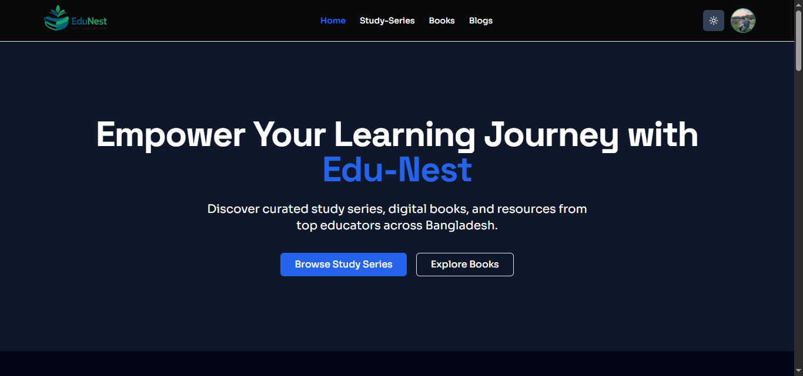
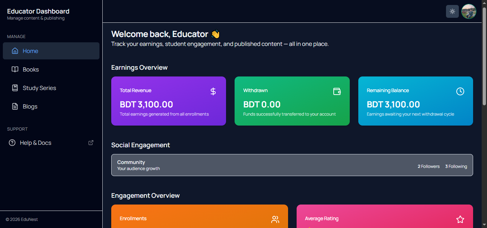
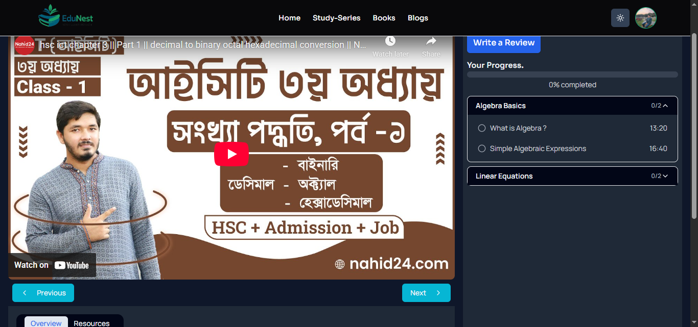
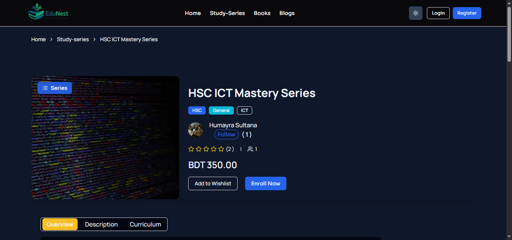
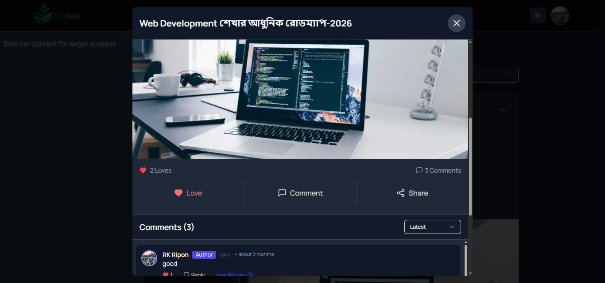
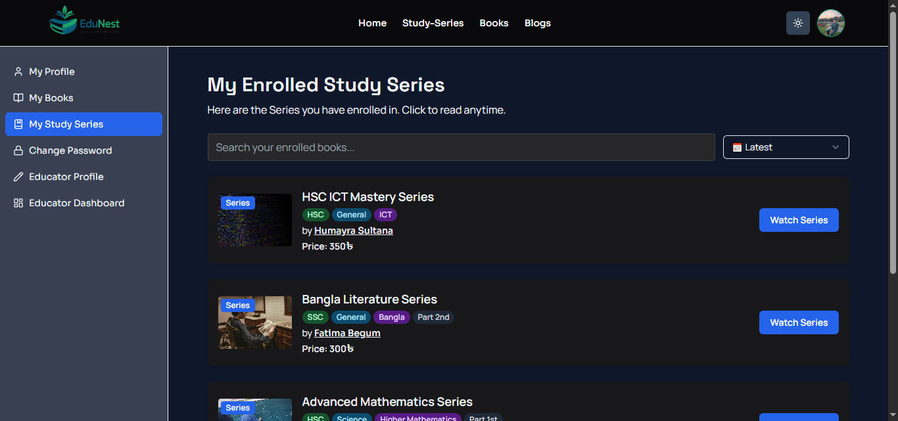

# 🎓 EduNest — Production-Ready Full-Stack EdTech Platform



🔗 **Live:** https://edu-nest-edu.vercel.app  
💻 **Repository:** https://github.com/rk-ripon313/Edu-Nest

**EduNest** is a production-ready **Learning Management System (LMS)** where students can purchase and consume digital books and video courses, and educators can publish, manage, and monetize educational content through a role-based dashboard.

Built with **Next.js 14 App Router**, EduNest focuses on **real-world product architecture**, not just UI-level CRUD functionality.

---

## 🌟 Why EduNest?

EduNest is designed to simulate a **real EdTech business model**, addressing challenges that appear in production systems:

- Multi-role users (Student & Educator)
- Paid digital content with secure access
- Progress-based learning experience
- Dashboard-driven publishing workflow
- Server-side authorization & validation

This makes EduNest a **portfolio project with real product depth**.

---

## 🚀 Core Features

### 📚 Student Experience

- Purchase **Books & Video Series** via **Stripe Checkout**
- Secure **PDF reader** for purchased books only
- Secure **Video lessons** with:
  - Resume playback
  - Per-user progress tracking
  - Completion indicators
- Centralized **My Learning** dashboard for all enrolled content

---

### 🧑‍🏫 Educator Dashboard



Educators manage all learning content from a dedicated, role-protected dashboard:

- Create, edit, and delete:
  - 📘 Digital Books (PDF + cover image)
  - 🎥 Video Series → Chapters → Lessons
  - 📝 Blogs
- Drag & drop chapter and lesson reordering
- Publish / unpublish controls
- Secure, role-based route protection

---

### 🎥 Video Learning Experience



- Purchase-verified video access
- Progress saved per user
- Resume watching from the last position

---

### 📝 Blogs & Community

- Public blog listing & single blog pages
- Like, comment, and share functionality
- Educator-only blog publishing
- Intercepting Routes for smooth navigation without context loss
- Built to support long-form educational content and community engagement

---

### 📧 Transactional Emails

- Automated transactional emails using **Resend**
- Email notifications sent to:
  - Students after successful purchase
  - Educators on new enrollments
- Emails triggered server-side after Stripe payment verification

---

## 🧱 System Architecture & Technical Decisions

### Authentication & Authorization

- **NextAuth v5** with JWT-based sessions
- Credentials & Google OAuth login
- Role-based route protection (Student / Educator)
- Server-side authorization checks via Server Actions

### Data Modeling

- **MongoDB** with **Mongoose ODM**
- Well-structured relational schema covering:
  - Users & Educator profiles
  - Books & Study Series (Chapters → Lessons)
  - Enrollments & Payments
  - Reviews, Ratings & Testimonials
  - Blogs, Comments & Replies
  - Learning progress tracking (Watch history & Reports)

> The schema is designed to support **scalable content publishing**, **social engagement**, and **learning progress tracking**, similar to real-world EdTech platforms.

### Payments & Content Protection

- Stripe Checkout integration
- Server-side purchase verification before:
  - PDF access
  - Video playback
- No client-side trust for protected resources

---

## 📸 Screenshots

| Home                            | Educator Dashboard                        |
| ------------------------------- | ----------------------------------------- |
|  |  |

| Video Lesson                             | Series Details                              |
| ---------------------------------------- | ------------------------------------------- |
|  |  |

| Blog (Intercepting Route)                    | My Learning                                   |
| -------------------------------------------- | --------------------------------------------- |
|  |  |

---

## 🧱 Tech Stack

- **Frontend:** Next.js 14, React 18, Tailwind CSS, ShadCN UI, Radix UI, Framer Motion
- **Backend:** Next.js Server Actions, MongoDB + Mongoose, NextAuth v5
- **Payments & Media:** Stripe, Cloudinary, Resend, React Player, React PDF

---

## 📦 Key Libraries

| Category        | Library                                   |
| --------------- | ----------------------------------------- |
| **Auth**        | `next-auth@beta`                          |
| **Database**    | `mongoose`                                |
| **Payments**    | `stripe`, `@stripe/stripe-js`             |
| **Email**       | `resend`                                  |
| **Media**       | `cloudinary`, `react-player`, `react-pdf` |
| **Forms**       | `react-hook-form`, `zod`                  |
| **UI**          | `@radix-ui/*`, `shadcn/ui`                |
| **Animation**   | `framer-motion`, `tailwindcss-animate`    |
| **Drag & Drop** | `@hello-pangea/dnd`                       |

---

## 🧭 Route Overview

### 🌍 Public

- `/` – Landing page
- `/books` – Book marketplace
- `/books/[id]` – Single book details
- `/study-series` – Video series listing
- `/study-series/[id]` – Single video series details
- `/blogs` – Knowledge hub
- `/blogs/[slug]` – Single blog post
- `/educators` – Instructor profiles
- `/educators/[userName]` – Instructor profile

### 🔐 Student

- `/books/[id]/read` – Protected PDF reader
- `/study-series/[id]/play` – Protected video player
<!-- -->
- `/account` – Account settings
- `/account/profile` – Profile management
- `/account/enrolled-books` – Purchased books
- `/account/enrolled-study-series` – Enrolled video series
- `/account/become-educator` – Educator application
- `/account/password` – Password change
<!-- -->
- `/enroll-success` - Post-purchase success page

### ⚡ Educator Dashboard

- `/account/educator-profile` – Educator profile management
<!-- -->
- `/dashboard/books` - Book management listing
- `/dashboard/books/add` - Create new book
- `/dashboard/books/[bookId]/edit` - Edit existing book
- `/dashboard/books/[bookId]/info` - View book enrollments & reviews
<!-- -->
- `/dashboard/study-series` - Study series management listing
- `/dashboard/study-series/add` - Create new study series
- `/dashboard/study-series/[studySeriesId]/edit` - Edit existing study series
- `/dashboard/study-series/[studySeriesId]/info` - View study series enrollments & reviews
<!-- -->
- `/dashboard/blogs` blogs feed management listing
- `/dashboard/blogs/add` Create new blog post
- `/dashboard/blogs/[blogId]/edit` Edit existing blog post

## 🧠 Learning Outcomes

This project helped me gain hands-on experience with:

- Building production-ready full-stack applications
- Secure payment and content protection
- Role-based dashboards and authorization
- Complex MongoDB relationships
- UX-focused, scalable component architecture

---

## 🔮 Future Improvements

- Course completion certificates
- Admin moderation panel
- Real-time student–educator chat
- Mobile application version

---

## 🔐 Environment Variables

```env
# Auth
AUTH_SECRET =
CUSTOM_JWT_SECRET=

GOOGLE_CLIENT_ID=
GOOGLE_CLIENT_SECRET=
GOOGLE_REFRESH_TOKEN=

# Database
MONGODB_URI=

# Payments
NEXT_PUBLIC_STRIPE_PUBLISHABLE_KEY=
STRIPE_SECRET_KEY=

# Email
RESEND_API_KEY=

# Media
CLOUDINARY_CLOUD_NAME=
CLOUDINARY_API_KEY=
CLOUDINARY_API_SECRET=

NEXT_PUBLIC_CLOUDINARY_CLOUD_NAME=
NEXT_PUBLIC_CLOUDINARY_UPLOAD_PRESET_VIDEO=
NEXT_PUBLIC_UPLOADCARE_PUBLIC_KEY=
```

## 👨‍💻 Author

**Rifat Kabir Ripon**  
Frontend Developer  
Focused on building **scalable, production-ready web applications**

🔗 GitHub: [rk-ripon313](https://github.com/rk-ripon313)  
🔗 LinkedIn: [rk-ripon313](https://www.linkedin.com/in/rk-ripon313)  
🔗 Portfolio: [rk-ripon313.vercel.app](https://rk-ripon313.vercel.app/)
