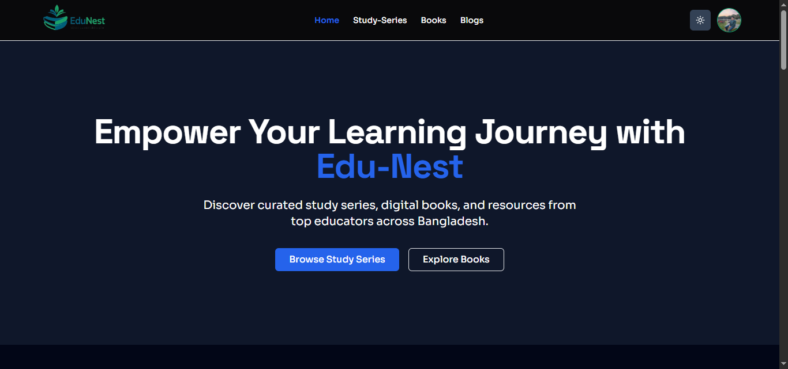
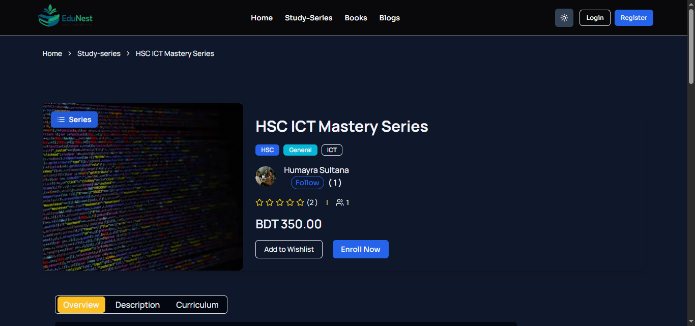
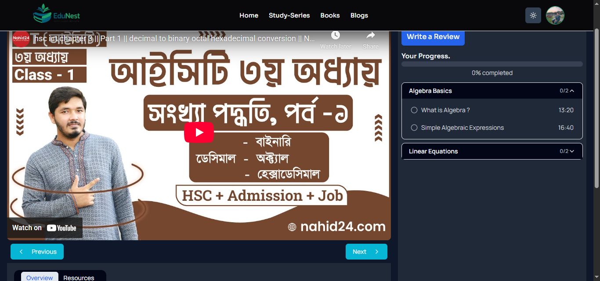
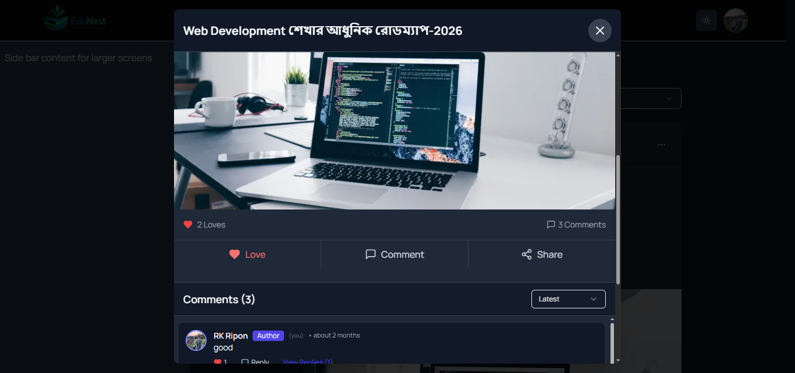
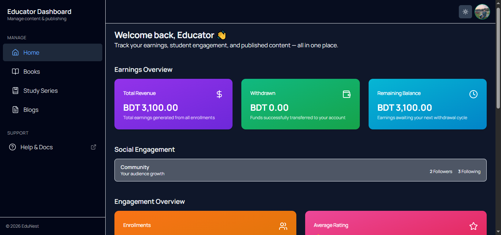

# 🎓 EduNest — Full Stack EdTech Learning Platform

🔗 **Live:** https://edu-nest-edu.vercel.app  
💻 **Repository:** https://github.com/rk-ripon313/Edu-Nest

EduNest is a modern **Full-Stack EdTech Learning Platform** where students can purchase digital books and video learning series, while educators can publish and manage educational content through a role-based dashboard.

The platform combines **content publishing, digital learning, payments, and community features** in one system.

---

## ✨ Core Features

### 🏠 Landing Page



The landing page highlights educational resources with sections including:

- Browse by Category
- Top Rated Books
- Top Rated Study Series
- Popular Educators
- Trending Blogs
- Popular Books
- Popular Study Series

---

### 📚 Books and Study-series Marketplace

Users can explore and purchase digital books and video learning series.

Features:

- Category filtering
- Price range filtering
- Label Group / Subject / Part filtering
- Sorting
- Search
- Pagination
- Responsive item cards

Each card displays:

- Cover image
- Educator name
- Average Ratings Reviews and Enrollment count
- Price
- Detailed information

---

### 📄 Books and Study-series Details Pages

Detailed pages provide complete information about books and study series including educator details, ratings, and related content.



Detailed pages for books and study series include:

- Comprehensive information
- Educator information
- Follow educator functionality
- Average Ratings Reviews and Enrollment count
- Purchase options
- Reviews and ratings details section
- Related content recommendations

---

### 🎥 Video Learning (Study-Series )

EduNest allows students to consume structured video lessons through a series-based learning system.



Video learning is structured as:

Series → Chapters → Lessons

Features:

- Lesson video playback
- Progress tracking
- Completion indicators
- Next / previous lesson navigation
- Resources tab

---

### 🔐 Protected Learning Experience

Purchased content is securely accessible only to enrolled users.

#### 📄 Secure PDF Reader

Built using **React PDF**

Features:

- Zoom
- Page navigation
- Protected access
- Review and rating system

---

#### 🎬 Video Lesson Player

Built using **React Player**

Features:

- Lesson navigation
- Completion tracking
- Progress indicator
- Lesson overview
- Resource tab

---

### 📝 Knowledge Hub (Blog System)

EduNest includes a full blogging system for educational content.

Features:

- Infinite scrolling blog feed
- Search and sorting
- Blog reactions
- Comments
- Replies
- Share functionality

### Modal Blog Experience ( intercepting routes )

Blog posts open in a **modal using Next.js Intercepting Routes**, allowing users to read without leaving the main blog feed.



---

### 👨‍🏫 Educator Profiles

Each educator profile includes:

- Overview
- Average Ratings Reviews and Enrollment count
- Follow system
- Published books
- Published Study series
- Published Blogs

---

### 💳 Payment System

EduNest integrates **Stripe Checkout** for secure payments.

After successful payment:

- Enrollment is verified server-side
- Purchased content becomes accessible
- Confirmation emails are sent automatically

---

### 📧 Automated Email System

Emails are sent using **Resend API**

Notifications include:

- Purchase confirmation for students
- New enrollment notification for educators
- Payment confirmation for card holders

---

## 🧑‍🏫 Educator Dashboard

Educators manage their content through a role-protected dashboard.



Dashboard includes:

- Earnings overview
- Social engagement
- Content statistics
- Followers and following
- Quick actions
- Recent enrollments
- Recent reviews

---

### 📘 Content Management

Educators can manage:

#### Books

- list of books using **React Table** with sorting, filtering, and pagination
- Create books
- Upload PDFs
- Publish / unpublish, delete and edit book details
- View enrollments and reviews information

#### Study Series

- list of study series using **React Table** with sorting, filtering, and pagination
- Create series
- Add chapters
- Add lessons
- Drag & drop reorder
- Preview free lessons
- Publish / unpublish, delete and edit details of series, chapters and lessons
- View enrollments and reviews information

#### Blogs

- Create blog posts
- Published/Unpublished Delete and edit blog content
- Manage blog feed
- View reactions and comments and replies information

---

## 👤 Student Account System

Students have a personal account dashboard including:

- Profile management
- Password change
- Enrolled books
- Enrolled study series
- Educator application system

---

## 🧠 Modern UX Features

The platform includes several modern UI/UX patterns:

- Infinite scrolling
- Modal content view
- Intercepting routes
- Drag & drop reordering
- Role-based UI rendering
- Protected routes
- Progressive loading

---

## 🧱 Tech Stack

- **Frontend:** Next.js 14 (App Router), React 18, Tailwind CSS, ShadCN UI, Radix UI, Framer Motion
- **Backend:** Next.js Server Actions, MongoDB, Mongoose
- **Authentication:** NextAuth v5 (Credentials & Google OAuth)
- **Services:** Stripe (Payments), Cloudinary (Media Storage), Resend (Email)

---

## 📦 Key Libraries

| Category               | Libraries                                                        |
| ---------------------- | ---------------------------------------------------------------- |
| **Framework**          | `next`, `react`                                                  |
| **Authentication**     | `next-auth`, `bcryptjs`, `jsonwebtoken`, `@auth/mongodb-adapter` |
| **Database**           | `mongodb`, `mongoose`                                            |
| **Payments**           | `stripe`, `@stripe/stripe-js`                                    |
| **Email**              | `resend`                                                         |
| **Forms & Validation** | `react-hook-form`, `zod`, `@hookform/resolvers`                  |
| **UI Components**      | `shadcn/ui`, `@radix-ui/*`                                       |
| **UI & UX**            | `lucide-react`, `swiper`, `next-themes`, `sonner`                |
| **Tables**             | `@tanstack/react-table`                                          |
| **Media & Learning**   | `react-player`, `react-pdf`                                      |
| **File Upload**        | `react-dropzone`, `browser-image-compression`, `cloudinary`      |
| **Drag & Drop**        | `@hello-pangea/dnd`                                              |
| **Editor**             | `react-quill`                                                    |
| **Animation**          | `framer-motion`, `tailwindcss-animate`                           |

---

## 🧭 Route Overview

### 🌍 Public

- `/` – Landing page
- `/books` – Book marketplace
- `/books/[id]` – Single book details
- `/study-series` – Video series listing
- `/study-series/[id]` – Single video series details
- `/blogs` – Knowledge hub
- `/blogs/[slug]` – Single blog post
- `/educators` – Instructor profiles
- `/educators/[userName]` – Instructor profile

### 🔐 Auth

- `/register` – User registration
- `/login` – User login

### 👤 Student Routes

- `/books/[id]/read` – Protected PDF reader
- `/study-series/[id]/play` – Protected video player
<!-- -->
- `/account` – Account settings
- `/account/profile` – Profile management
- `/account/enrolled-books` – Purchased books
- `/account/enrolled-study-series` – Enrolled video series
- `/account/become-educator` – Educator application
- `/account/password` – Password change
- `/account/educator-profile` – Educator profile management
<!-- -->
- `/enroll-success` - Post-purchase success page

### 🧑‍🏫 Educator Dashboard

- `/dashboard` - Dashboard home

Books

- `/dashboard/books` - Book management listing
- `/dashboard/books/add` - Create new book
- `/dashboard/books/[bookId]/edit` - Edit existing book
- `/dashboard/books/[bookId]/info` - View book enrollments & reviews

Study-series

- `/dashboard/study-series` - Study series management listing
- `/dashboard/study-series/add` - Create new study series
- `/dashboard/study-series/[studySeriesId]/edit` - Edit existing study series
- `/dashboard/study-series/[studySeriesId]/info` - View study series enrollments & reviews

Blogs

- `/dashboard/blogs` blogs feed management listing
- `/dashboard/blogs/add` Create new blog post
- `/dashboard/blogs/[blogId]/edit` Edit existing blog post

---

## ⚙️ Local Development Setup

Clone the repository:

```bash
git clone https://github.com/rk-ripon313/Edu-Nest.git
```

Install dependencies:

```bash
npm install
```

Run the development server:

```bash
npm run dev
```

---

## 🔐 Environment Variables

Create `.env.local`

```env
# Auth
AUTH_SECRET =
CUSTOM_JWT_SECRET=

GOOGLE_CLIENT_ID=
GOOGLE_CLIENT_SECRET=
GOOGLE_REFRESH_TOKEN=

# Database
MONGODB_URI=

# Payments
NEXT_PUBLIC_STRIPE_PUBLISHABLE_KEY=
STRIPE_SECRET_KEY=

# Email
RESEND_API_KEY=

# Media
CLOUDINARY_CLOUD_NAME=
CLOUDINARY_API_KEY=
CLOUDINARY_API_SECRET=

NEXT_PUBLIC_CLOUDINARY_CLOUD_NAME=
NEXT_PUBLIC_CLOUDINARY_UPLOAD_PRESET_VIDEO=
NEXT_PUBLIC_UPLOADCARE_PUBLIC_KEY=
```

---

## 🧠 Learning Outcomes

While building EduNest I gained practical experience with:

- Building full stack applications using Next.js
- Implementing role based authentication
- Integrating payment systems
- Designing scalable database models
- Creating modern UI architecture

---

## 🚀 Future Improvements

- Admin moderation panel
- Course completion certificates
- Real-time chat between students and educators
- Recommendation system
- Mobile application

---

## 👨‍💻 Author

**Rifat Kabir Ripon**  
Frontend Developer  
Focused on building **scalable, production-ready web applications**

🔗 GitHub: [rk-ripon313](https://github.com/rk-ripon313)  
🔗 LinkedIn: [rk-ripon313](https://www.linkedin.com/in/rk-ripon313)  
🔗 Portfolio: [rk-ripon313.vercel.app](https://rk-ripon313.vercel.app/)
